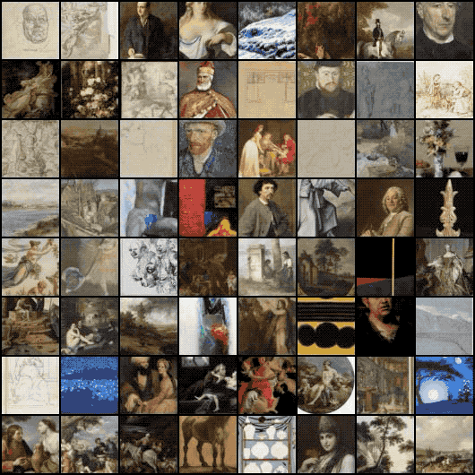
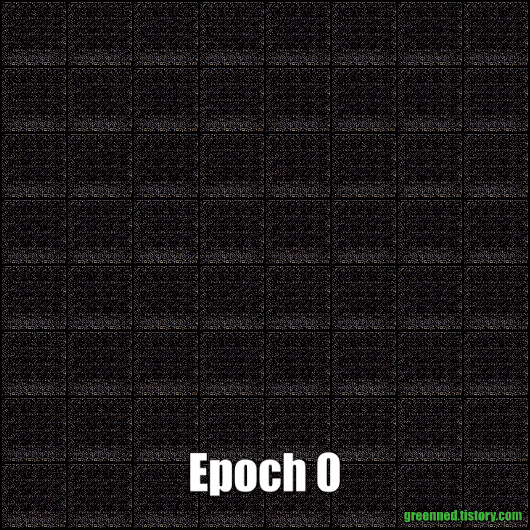
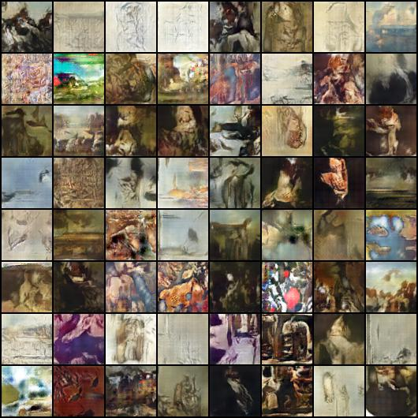

# DCGAN 기반 서양화 만들기

- DCGAN 알고리즘을 활용하여 서양화를 그려보고 싶었습니다.
- 일단은 주제와 상관없이 무작위로 수집하여 학습을 진행하였습니다.
- /crawler 경로에 네이버 이미지를 수집할 수 있는 코드가 있으니 참고하세요.

## 학습데이터

- 아래와 같은 그림을 10,000여장을 학습하였습니다

## 결과물

|     Epoch에 따른 이미지 변화      |      Epoch==100 이미지      |
| :-------------------------------: | :-------------------------: |
|  |  |
